# Razor Sharp

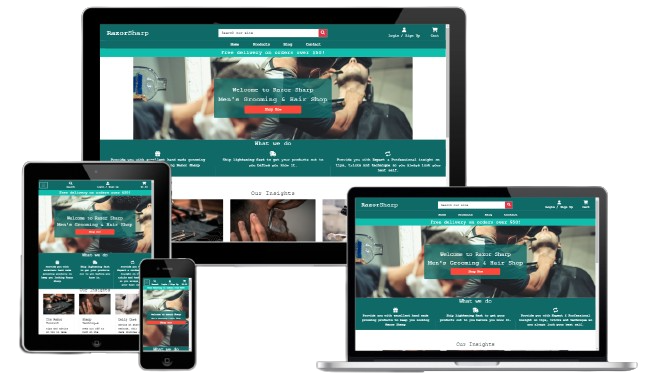

## A Mens Grooming E-commerce Store.
> A Men's grooming e-commerce website that provides goods for sale as well as blog content to share tips and advice.

### - By Alan Bushell

## **[Live site](https://abushell-razor-sharp.herokuapp.com/)**

## **[Repository](https://github.com/Alan-Bushell/razor-sharp)**

---
  
## Table of contents
<a name="contents">Back to Top</a>
 1. [ UX ](#ux)
 2. [ SEO ](#seo)
 3. [Agile Development](#agile)
 4. [ Features ](#features)  
 5. [ Features Left to Implement ](#left)  
 6. [ Technology used ](#tech) 
 7. [ Testing ](#testing)  
 8. [ Bugs ](#bugs)  
 9. [ Deployment](#deployment)
 10. [ Credits](#credits)
 11. [ Content](#content)  
 12. [ Acknowledgements](#acknowledgements)  

---

## UX

### Color Pallette

 Color Pallete 

 

### Database Schema

 Database Structure

 

This was the suspected preproject planning database structure. As the project was being developed changes were made to the final project due to time contraints and project scope.

---

Accounts App

 

#### Account Model
| id | Field |
|--|--|
|first_name|CharField|
|last_name|CharField|
|username|CharField|
|email|EmailField|
|phone_number|CharField|
|date_joined|DateTimeField|
|last_login|DateTimeField|
|is_admin|BooleanField|
|is_staff|BooleanField|
|is_active|BooleanField|
|is_superadmin|BooleanField|

#### UserProfile Model

| id | Field |
|--|--|
|user|OneToOneField|
|street_address1|CharField|
|street_address2|CharField|
|town_or_city|CharField|
|county|CharField|
|postcode|CharField|
|country|CountryField|
|profile_picture|ImageField|

---

Blog App

 

#### Post Model

| id | Field |
|--|--|
|title|CharField|
|slug|SlugField|
|author|ForeignKey|
|updated_on|DateTimeField|
|content|TextField|
|featured_image|ImageField|
|excerpt|TextField|
|created_on|DateTimeField|
|status|BooleanField|
|likes|ManyToManyField|

#### Comment Model

| id | Field |
|--|--|
|post|ForeignKey|
|body|TextField|
|created_on|DateTimeField|
|username|ForeignKey|

---

Cart App

 

#### Cart Model

| id | Field |
|--|--|
|cart_id|CharField|
|date_added|DateField|

#### CartItem Model

| id | Field |
|--|--|
|product|ForeignKey|
|cart|ForeignKey|
|quantity|IntegerField|
|is_active|BooleanField|

---

Checkout App

 

#### Order Model

| id | Field |
|--|--|
|user|ForeignKey|
|order_number|CharField|
|first_name|CharField|
|last_name|CharField|
|email|EmailField|
|phone_number|CharField|
|country|CountryField|
|street_address1|CharField|
|street_address2|CharField|
|town_or_city|CharField|
|postcode|CharField|
|county|CharField|
|date|DateTimeField|
|deliver_cost|DecimalField|
|order_total|DecimalField|
|grand_total|DecimalField|
|original_cart|TextField|
|stripe_pid|CharField|
|is_ordered|BooleanField|

#### OrderLineItem Model
| id | Field |
|--|--|
|order|ForeignKey|
|product|ForeignKey|
|quantity|IntegerField|
|lineitem_total|DecimalField|

---

Contact App

 

#### Contact Model

|id|Field|
|--|--|
|email|EmailField|
|subject|CharField|
|message|TextField|
|reason|CharField|

  
---

Products App

 

#### Categrory Model

|id|Field|
|--|--|
|name|CharField|
|slug|SlugField|
|friendly_name|CharField|
|description|TextField|

#### Product Model

|id|Field|
|--|--|
|product_name|CharField|
|slug|SlugField|
|description|TextField|
|price|DecimalField|
|stock|IntegerField|
|in_stock|BooleanField|
|has_sizes|BooleanField|
|category|ForeignKey|
|item_added|DateTimeField|
|last_modified|DateTimeField|
|image_url|URLField|
|image|ImageField|
|rating|FloatField|

#### Review Model

|id|Field|
|--|--|
|product|ForeignKey|
|user|ForeignKey|
|subject|CharField|
|review|TextField|
|rating|FloatField|
|status|BooleanField|
|created_at|DateTimeField|
  

## UX design

### Overview

#### Site User
The typical site user would be a male aged between 18 and 50 who has an interest in self care, grooming and presenting a good outward image. Additional site users could be partners of user 1 and may be browsing the site to purchase gifts for them.

####  Goals for the website
The goals for the website are:
- An easy to navigate website with clear purpose
- Provide users with products that meet their expectations
- Allow users to view, read and comment on articles that may help or interest them.
- To gain insights or tips on self care.
- Allow users to checkout quickly and easily
- To allow users to create a profile to view past orders and update profile information

### Wireframes

 Wireframes 

 

---

# SEO

### SEO Project planning

Once the business model was decided on as an a men's grooming store I started working on how to market the site and what keywords to target.
I utilised google trends to find more popular search terms and also used a tool called SEO quake to compare the competition and see what they are doing well.
I checked for a number of keywords on wordtracker.com and signed up for a trial to get as much out of it as possible. From there I developed a list of short tail and long tail keywords I intended to use in this project.

### Keywords

Short-tail - Razor Sharp, Hand Razor, Mens Razor, Men's Grooming, Beard Care, Beard Shaping, Razor Sharp, Men's Grooming, Hair Care, Beard Care, Shaving, Hair Styling, Skin Care, Grooming products, Affordable prices, Mens grooming

long-tail -  beard care gifts for men,  Shaving gifts for men,  Grooming gifts for men, hair care gifts for men, Men's Hair Care Men's Beard Care,  Razor for men, mens first razor

By utilising the short tail keywords and analysing the results from google trends, and the related questions I was able to generate a list of longtail keywords.
The keywords are used throughoutn the site at different places.

I make use of the <strong>Strong</strong> tag where necessary and ensure all links are described correctly.

### Sitemap.xml
I generated a sitemap for the site so that once ready engines like google can search it effectively.

### Robots.txt
I generated a robots.txt file so that google could crawl the site. I have blocked off the accounts app as there is no benefit for google to crawl those pages.

### Facebook Business Page

To view the facebook business page you can click on the link below:

[Facebook Business Page](https://www.facebook.com/profile.php?id=100089813350334)

In case the page becomes inactive or deactivated by Facebook I have taken screenshots to display here also:

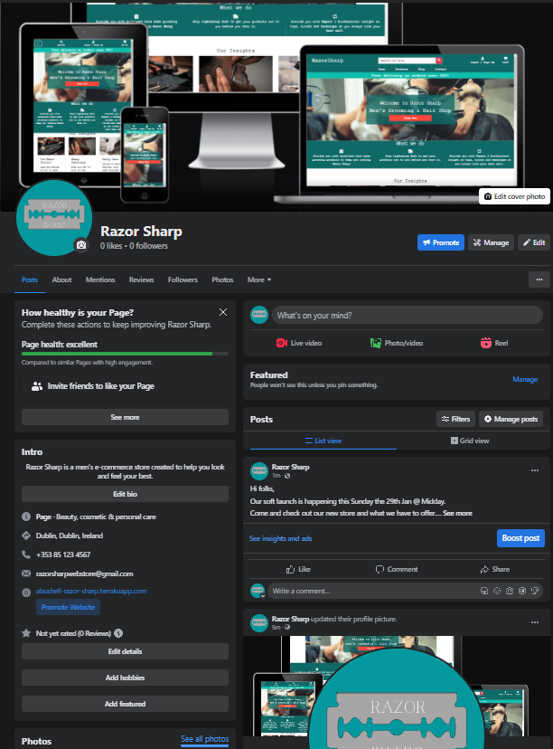

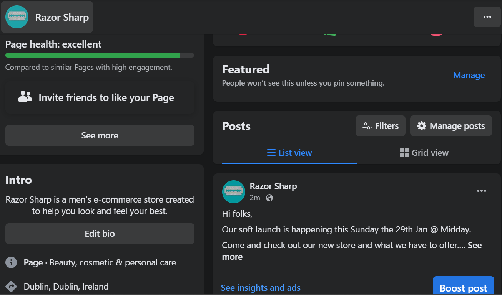

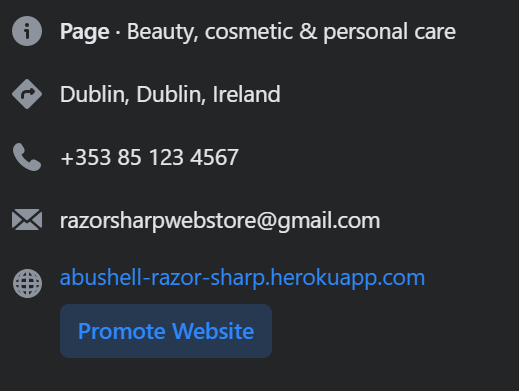

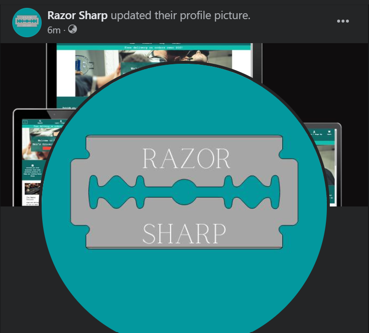

[Back to Top of page](#seo)

---

## Agile Development

### Agile Overview
Once I had an initial idea of the website I was going to build I started the preplanning by creating a github projects page to track the epics, user stories and tasks required to work through for this project.

It gave me an idea of how long this project was expected to take and how to manage my workload effectively.

As I worked through the workload I moved tasks from not started to in progress to completed once the task was done. Occasionally I would find other work that were either new tasks or subtasks that required attention before completing a larger task.

I also documented some of the bugs I have come across on this project in the projects board.

One of the sections in my project boards is called NINTH. This stands for "Not importants, nice to have". This is usually for expanding the project beyond MVP and adding additional features to enhance user experience.

### Github Project Board
To see the final project board for Razor Sharp you can click the link below:
[Razor Sharp Project Board](https://github.com/users/Alan-Bushell/projects/8)

#### Epics

 1. [Epic: Create Base Project](https://github.com/Alan-Bushell/razor-sharp/issues/1)
 2. [Epic: User Authentication](https://github.com/Alan-Bushell/razor-sharp/issues/2)
 3. [Epic: Navigation & Views](https://github.com/Alan-Bushell/razor-sharp/issues/39)
 4. [Epic: Admin & Stock Management](https://github.com/Alan-Bushell/razor-sharp/issues/44)
 5. [Epic: Blog](https://github.com/Alan-Bushell/razor-sharp/issues/13)
 6. [Epic: Contact](https://github.com/Alan-Bushell/razor-sharp/issues/60)
 7. [Epic: Deploy Project](https://github.com/Alan-Bushell/razor-sharp/issues/35)
 8. [Epic: Newsletter](https://github.com/Alan-Bushell/razor-sharp/issues/17)
 9. [Epic: Post Order Options](https://github.com/Alan-Bushell/razor-sharp/issues/26)
 10. [Epic: Profiles](https://github.com/Alan-Bushell/razor-sharp/issues/9)
 11. [Epic: SEO](https://github.com/Alan-Bushell/razor-sharp/issues/29)
 12. [Epic: Shopping Cart](https://github.com/Alan-Bushell/razor-sharp/issues/7)

Each Epic may have one or more user stories associated and each user story may have tasks.

The full breakdown of user stories and tasks are included on the project board above.

Due to time contsraints some aspects of the project were deemed not mandatory and moved into the NINTH column. 

These remain unfinished and can also be viewed from the project board. This would give an indication of the direction the site would move in going forward.

[Back to Top of page](#contents)

---

## Features

 Navigation 

 

The Desktop navigation was based on Boutique Ado and seemed like a concise and clear option for an e-commerce store. 

Mobile Navigation
  
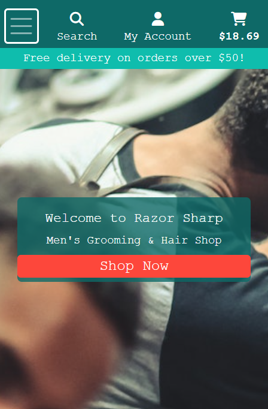

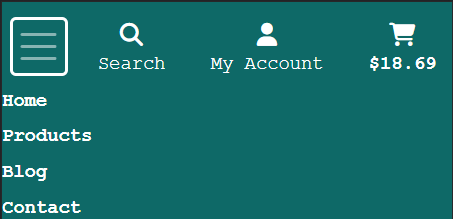
  
When developing this application I decided I wanted to add a detailed footer as would be found on most e-commerce websites.

 Authentication 

 

The authentication flows come from Allauth and have been styled to fit the theme of my website. At present when a user signs up a confirmation email is sent to their email address to confirm it before being able to access their account. Unfortunately due to gmail authentication issues preventing emails from being sent from the deployed project at this moment in time, new users cannot authenticate on their own. Will revisit this issue to resolve.
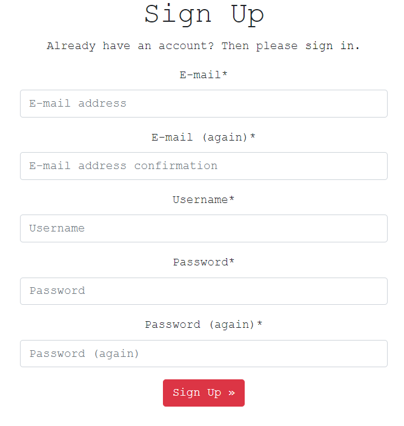

 Products Page 

 

The products page is responsive to allow equal spacing between products regardless of screen width.
  
Out of stock products do not show up to customers but in the event that the customer somehow gets access to a product that is out of stock, the add to card button is disabled to prevent out of stock purchases.
  
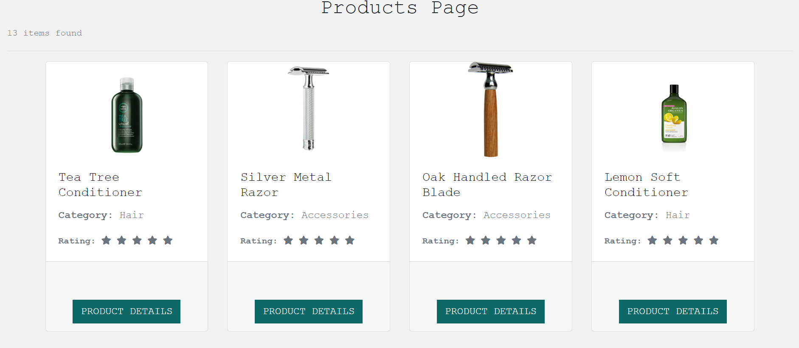

The product detail page was intended to include a reviews option for logged in users who also purchased the specific product. As you can see an option on the order model of is_ordered set as a boolean value that would be triggered on order completion and added to users profile. This functionality is not in place in this iteration of the project but will be added in the next iteration. From there the reviews rating would be calculated based on the average score of reviews.

 Cart & Checkout Flow 

 

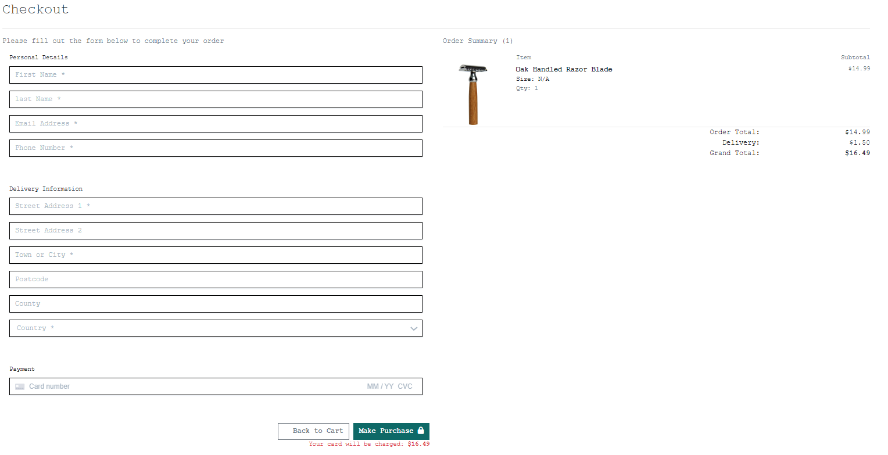

  
Once the customer makes a successful paymeent they are redirected to the payment success page where they see a summary of their order. 

 Account Profiles 

 

The account profiles app was designed to make it easy for customers to carry out some basic post order options. 
The facility to update their account information, change their shipping address or profile photo. Even close their account if they no longer wish to have one.

We allow users to add and update their profile image as we display their image beside their username when they make comments on blog posts. 
This was intended to create some form of personalisation and encourage people to discuss on the websites soon to be many topics.

The customer can visit their order confirmation by clicking on the order number in the order history page. Once directed to this page they will be notified by a pop up message that this is displaying a previous order and not a new one.
  
The customer can return to the profile by clicking on the button below the order form.

 Blog 

 

The idea behind blogs was to firstly create informative and helpful articles to boost SEO and also to create a place for users to ask questions, share insights and converse with like minded people.  

  
The initial blog articles although basic are the start of what will be expanded on. At present users can comment on blogs and like blog articles. The future features will be added below.

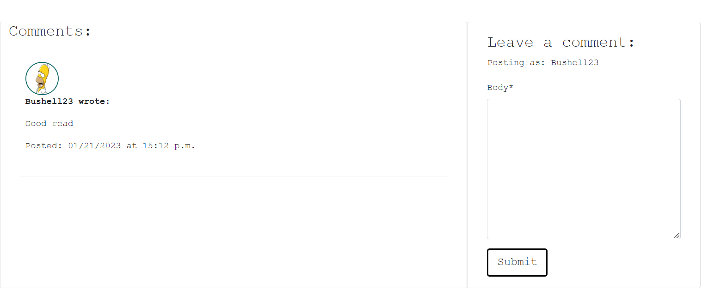

 Contact Page 

 

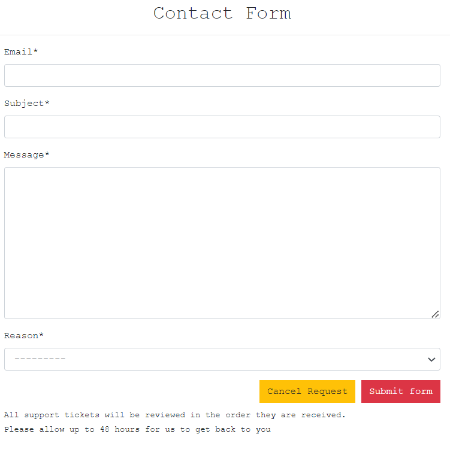
  
The contact form was designed to be a model that sends the message to the backend of the website. In the future I will enable email notifications to the business email address and filter them depending on contact reason. For example if the query selected is complaint then the email will be forwarded to the complaints email address the ensure swift response from the correct employee of the business.

 Account Notifications 

 

When a user signs in or out they see a notification like the below to indicate this with the relevant action just taken.

If a user navigates from their account profile to the below they are notified as it is reusing the same payment confirmation page once the user makes an order and pays.

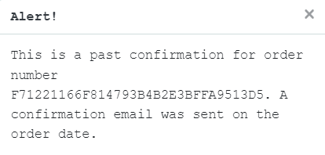

When a user adds an item to cart they see the below notification.
  

 Admin related permissions 

 

When the superuser logs into the account they have additional front end permissions to edit, delete and add products to the website.
The edit option and delete options are available on the products page and the add product option is on the product management page on the my account dropdown.

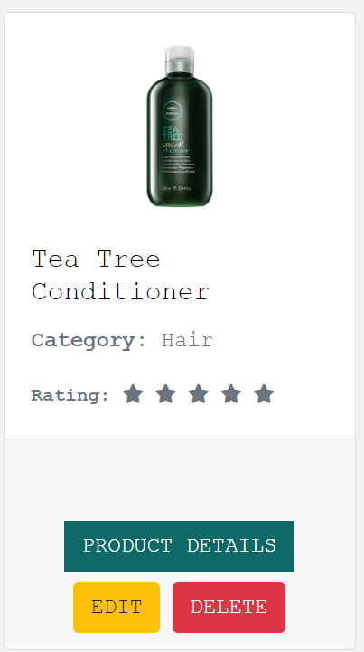

 Additional Pages 

 

To ensure the page reflects that of a genuine e-commerce page I wanted to include shipping policy's and FAQ's to ensure customers common queries are available.
  

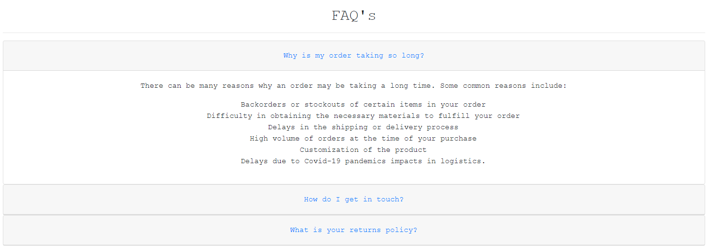
  
I have included a subscribe option for customer to provide their emails to be added to mailing lists for offers tips and tricks. This service is provided by mailchimp.
  
Initially I was considering creating a subscribe model and attaching it to the userprofile model so they can subscribe and unsub at their leisure but due to time constrainst i decided to go with mailchimp.

#### Account restrictions:

When an unverified or not logged in user trys to access the accounts section of the site they are notified they do not have permissions and then redirected back to home.

For the short term and to prevent spam, when a non logged in user trys to access the contact form page they are advised to login and redirected back to the home page. This was a personal choice and by design but in the next iteration I would add a "honey pot" type input that is hidden from the front end user. If this option is checked then it would be prevented from being submitted as it would show signs of spam / bot activity.

[Back to Top of page](#contents)

---

## Features left to Implement 

#### Subscriptions
My intention for this project was to implement subscriptions but due to time constraints it became unrealistic to implement them effectively. This will be one of the first options I intend to include upon developing this project further.

#### User interaction features
Features including allowing users to reply directly to each other through blog articles, possible even add threads that users can generate themselves to increase and develop a community.
I would also like to add a notification system for users to be able to see replys, likes in a bell icon from their account.

#### Frequently Bought Items
In future iterations I would implement a Frequently added products section that would present itself on the initial cart page before checkout to help drive upsells.

#### Product Reviews
At present the products have a fixed rating set by the site admin which is not a true reflection of customer satisfaction. In the next iteration customers would be able to leave reviews on products they have successfully purchased once they are logged in. I will then calculate the average and return a star rating based on the float figure.

#### Honey Pot spam filter for contact form
This is a basic feature to prevent bot spam messages and while it is not 100% effective, coupled with other features it would reduce spam to close to zero. 
This works as a hidden input value on the form that the front end user cannot click. However bots can and generally do. If the option is ticked the submitted form is either not forwarded to staff or the form is disabled completely.

#### E-mail forwarding for all site actions.
As I have a dropdown model for the contact form, depending on the size of the business I would like to forward the emails to specific email addresses monitored by different staff departments. For example the complaints emails go to the complaints teams to ensure quick responses and reduce friction.

#### Order Tracking
Going forward I would like to add an order tracking system for the user profile section. Once order placed the merchant can move the product to dispatched and add tracking that can then be viewed by the customer from within their account and also receive an email with the updates.

#### Front end order tracking and accounts management for business
This would involve creating a front end accounts page to display orders and graphs for employees of the business beyond django cms. 
These would allow the business to track orders over days, months and year on year as well as track most popular products.

[Back to Top of page](#contents)

---

##  Technology Used

### Html

 - Used to structure my website

### CSS

 - Custom CSS was written on large chunks of this site to make it as close to the wireframes as I felt it needed to be.

### JavaScript

 -  Used to add timeout function for messages as well as to enable the menu on index.html

### Python

 -  Used for the logic in this project.

### Django

 -  Framework used to build this project. Provides a ready installed admin panel and includes many helper template tags that make writing code quick and efficient.

### Font Awesome

 -  Icon library used

### Bootstrap 4
 - Used as the base front end framework to work alongside Django

### Jinja Templating with Django
 - Used to render logic within html documents and make the website more dynamic.

### GitHub
 - Used to store the code for this project & for the projects Kanban board used to complete it.

### Heroku
 - Used to host and deploy this project

### Heroku PostgreSQL
 - Heroku PostgreSQL was used as the database for this project during development and in production.

### Git
- Used for version control throughout the project and to ensure a good clean record of work done was maintained.

### AWS S3 and IAM
- Used to host static and media files for this project and IAM for the permissions based roles for accessing the S3 buckets.

### Django-Crispy-Forms
- Used to style the forms in this project.

[Back to Top of page](#contents)

---

## Testing

### Testing Phase

#### Manual Testing

>If the intended outcome completes then this will be flagged as pass. If it does not then this is a fail.

#### Account Registration Tests
| Test |Result  |
|--|--|

---

#### User Navigation Tests

| Test |Result  |
|--|--|

---

#### Account Security Tests

| Test |Result  |
|--|--|

--- 

#### Profile Tests

| Test |Result  |
|--|--|

#### Admin Tests

| Test |Result  |
|--|--|

---

## Google Lighthouse Testing

### Desktop

> index.html

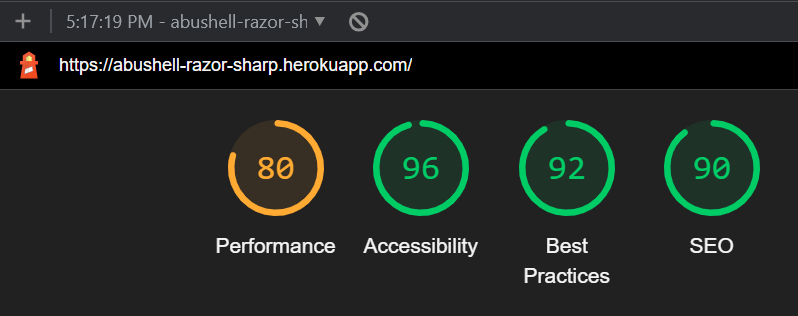

> profile.html

## HTML W3 Validation

### index.html

#### Result: No Errors

### CSS Validation

#### Result: 

[Back to Top of page](#contents)

---

## **Bugs**

[Back to Top of page](#contents)

---

## Deployment

#### Forking the repository

[Back to Top of page](#contents)

---
  

## Credits
  
[Back to Top of page](#contents)

---

## Content & Resources
  
##### Django Documentation
  - Read through the django documentation multiple times when trying to implement models and other content.
  
##### W3 Schools
  - Used for reference throughout for simple css examples.
  
##### Code Institute
  - Course content for portfolio project 5 helped greatly in being able to complete this project.
  - I found the walkthroughs informative and well paced.
  - Initial structure based heavily on the CI walkthrough until I got more comfortable with the framework and started to make it my own.
  - Some legacy code regarding nav remains.

[Back to Top of page](#contents)

---

## Acknowledgements

### Dick Vlandeeren
> My mentor who provided me with constructive feedback  and guidance throughout.
